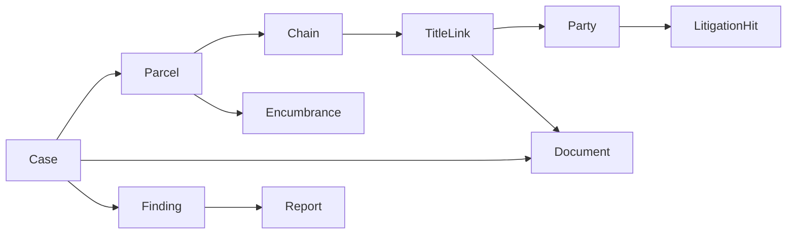
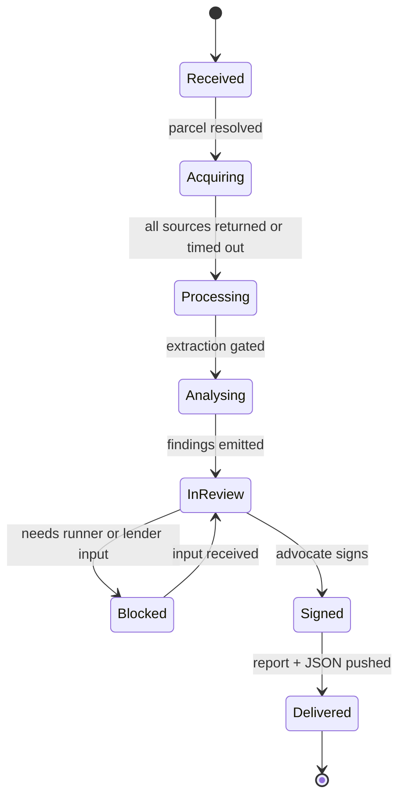
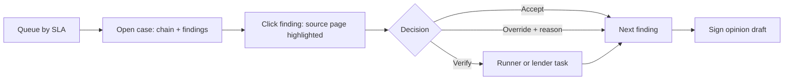

# HLD — Land Title Diligence Engine (Jharkhand-first)

2026-09-19 · @Someone

## 1. Purpose & scope

The system takes a property and a borrower from a lender, assembles the chain of title from Jharkhand's revenue records (khatian, Register-II), the registration record (deeds, non-encumbrance search) and borrower documents, and returns an evidence-linked risk report signed by an advocate in 3–5 working days instead of 3–6 weeks.

It is a **risk report, not a title guarantee**. Every finding links to the page and field it came from, and every gap the machine cannot close is handed to a human with a specific instruction. In Jharkhand the first question is not "who owns it" but "can this land be transferred at all": the nature of the land (kism) and the category of every holder in the chain under the Chotanagpur Tenancy Act decide that before ownership is even examined, and the engine is built around that order.

| In scope (v0) | Out of scope (v0) |
| --- | --- |
| Jharkhand, Chotanagpur divisions only — Ranchi, Jamshedpur, Dhanbad, Bokaro, Hazaribagh | Santhal Pargana division (SPT Act s.20 bars transfer of raiyati land; handled as detect-and-block in v1) |
| Urban residential resale: registered flats and plots on raiyati, khas mahal and municipal land; Jamshedpur sub-lease properties | Agricultural land, bhuinhari and Mundari khuntkatti tenures, gair mazarua land (detected and blocked, not diligenced) |
| Lender-initiated searches (home loan / LAP) | Consumer-facing title checks |
| Report + advocate opinion as output | Title insurance, indemnity, any liability for the opinion |
| Litigation check via eCourts by party name and property, plus revenue-court (SAR, DCLR) check where registers are reachable | Physical site inspection (flagged, not performed) |

Success in v0 means: report turnaround under 5 working days for 80% of cases (under 48 hours where no physical search is needed), zero findings that cannot be traced to a source page, no CNT transferability finding overturned by the advocate on review, and the reviewing advocate spending under 45 minutes per case.

## 2. Actors & external systems

Three kinds of people touch a case; the rest of the world is reached through adapters that can each fail independently.

| Actor | Role in the system | How they interact |
| --- | --- | --- |
| Lender credit / ops team | Raises the search, uploads borrower documents, consumes the report | LOS integration (REST + webhook) or web portal |
| Reviewing advocate (empanelled, practising in Jharkhand courts) | Reviews machine findings, verifies gaps, signs the opinion | Review console; every finding shows its evidence |
| Runner (per district) | Physical searches: NEC at the DSR office, certified khatian from the Record Room, SAR and CO register checks | Task app with structured return forms and photo upload |
| Kaithi / Urdu transcriber | Converts CS-era khatians and old deeds into typed text | Transcription console; output is a Document with source = human |
| Internal ops | Watches adapter health and runner task ageing, resolves stuck cases | Ops console + alerts |
| Rules author (advocate with revenue-court practice) | Maintains the Jharkhand rules pack | Versioned config repo with review |
| Admin | Tenants, users, RBAC, billing | Admin console |

| External system | What we pull | Access pattern | Reliability |
| --- | --- | --- | --- |
| Jharbhoomi (Register-II / Panji-II, mutation status, online lagan) | Current record of rights: khata, plot, raiyat, area, rent; dakhil-kharij history | Portal automation | Format stable; coverage uneven by anchal; entries lag mutation orders |
| Bhu-Naksha Jharkhand | Plot map by mauza and khesra number | Portal automation | Good for identity, weak for area disputes |
| CS / RS khatian (survey records) | Original raiyat, caste or tribe entry, kism, plot area — the root of title | Certified copy from the district Record Room via runner; some scans on Jharbhoomi | Physical; CS-era records in Kaithi or Urdu |
| Jharnibandhan / District Sub-Registrar office | Registered deeds, index search, non-encumbrance certificate (NEC) | Online deed search for recent years; NEC and older index by physical search via runner | Physical search is the SLA floor |
| Circle Office (anchal) | Mutation orders, objections, correction cases | Runner; some status online | Slow; orders often unscanned |
| DC office — SAR court, DCLR, Divisional Commissioner | Revenue litigation: s.71A restoration claims, mutation appeals, land disputes | Runner register search; online status where the revenue-court system covers the district | Not on eCourts; the highest-risk blind spot |
| eCourts / NJDG (district courts, High Court at Ranchi) | Title suits, partition, injunctions, s.138 and recovery matters by party name | Structured API (CNR-keyed), order PDFs | Good; name matching is the hard part |
| Municipal bodies (RMC, JNAC, Mango, Jugsalai, Adityapur, Dhanbad) | Holding tax record and receipts, name on record | Portal where available, else runner | Varies widely |
| Tata Steel / Tata Steel UISL (Jamshedpur company area) | Sub-lease or allotment, transfer consent, dues clearance | Via borrower and the lessee's records office | Reliable but slow; consent is a hard prerequisite |
| CERSAI | Registered security interests | Paid API / portal | Reliable |
| Society / builder (via borrower) | Allotment, share certificate, NOC, building plan sanction (RRDA / JNAC), RERA registration | Uploaded documents | Untrusted until cross-checked |

The runner network is the primary acquisition channel in Jharkhand, not a fallback: the non-encumbrance search at the DSR office, certified khatian copies from the Record Room and SAR register checks at the DC office are physical tasks for most cases. The system models them as tasks with SLAs, structured return forms and per-district capacity from day one, and the case cost ledger carries their fees.

## 3. Domain model

The centre of the model is the **TitleLink**: one transfer of ownership, backed by one or more documents, from one set of parties to another. A chain is an ordered list of links; every finding attaches to a link, a document, or the parcel.



A Case owns everything; a Parcel is the thing being searched; the Chain is what the engine builds from Documents; Findings are what the engine and the advocate say about it.

| Entity | Key fields | Notes |
| --- | --- | --- |
| Case | tenant, lender ref, parcel, borrower parties, status, SLA clock, cost ledger | State machine, see §5 |
| Parcel | district, anchal, mauza, thana number, khata number, plot (khesra) number, kism (raiyati / khas mahal / gair mazarua khas / gair mazarua aam / bhuinhari / khuntkatti), CS and RS khatian references, flat or holding number, area, ULPIN if present | Kism is a title fact, not metadata: it decides which rules apply before the chain is built |
| Document | type, source (portal / upload / runner / transcription), raw file, pages, script, extracted fields with confidence and bounding boxes, trust level | Immutable once ingested; a transcription is a Document that points at the scan it was made from |
| Party | canonical name, name variants (Devanagari / English / Kaithi transliteration, father's name), role, **category (ST / SC / BC / General) as a dated fact with its source** (khatian entry, caste certificate, deed recital), ID hints (PAN masked), relationships | Category at the date of each transfer is what the CNT Act turns on; it is never inferred from a surname |
| TitleLink | from-parties, to-parties, instrument type (sale, gift, release, partition, succession, court decree, settlement, sub-lease assignment), date, registration ref, stamp paid, consideration, **DC sanction reference where required (s.46 / s.49)**, mutation (dakhil-kharij) status, supporting document ids, validation status | One link per transfer; a link missing a required sanction is void, not merely defective |
| Chain | ordered links, root-of-title document (normally the RS or CS khatian entry), coverage window (30 years), gaps | Gaps are first-class objects, not the absence of links |
| Encumbrance | type (mortgage, charge, lis pendens, lease, **s.71A restoration claim, SAR proceeding**), holder, amount, source, released? | From the deed index, CERSAI, revenue courts and documents |
| LitigationHit | CNR or revenue case number, forum (civil court / SAR / DCLR / CO), parties matched, match confidence, stage, relevance | Fuzzy-matched; advocate confirms relevance |
| Finding | severity (blocker / major / minor / info), rule id, subject (link / doc / parcel), evidence pointers, machine rationale, reviewer decision, verification instruction | The unit of output. Nothing reaches the report without one |
| Report | version, findings, chain summary, advocate opinion, signature, delivered-to | PDF + structured JSON to the LOS |

Three deliberate choices: Party is separate from any single document because the same person is spelled five ways across 30 years; a Gap is modelled as a thing with a reason ("no registered instrument between 2004 and 2011; possible unregistered family partition") rather than as missing data; and category and kism are stored as dated, sourced facts because in Jharkhand a sale that is perfectly formed on paper can still be void for who the seller was or what the land was.

## 4. System architecture

Six layers, joined by an event bus. Each stage is a consumer that reads a case event, does one job, writes its result, and emits the next event; nothing calls the next stage directly, so any stage can be re-run, replayed, or replaced by a human.

```
 ┌─────────────────────────────────────────────────────────────────────┐
 │  EDGE          Lender API (REST+webhook) │ Lender portal │ Review  │
 │                                          │               │ console │
 └──────────────────────────┬──────────────────────────────────────────┘
                            ▼
 ┌─────────────────────────────────────────────────────────────────────┐
 │  CASE SERVICE   case state machine · SLA clock · cost ledger        │
 │                 tenant/RBAC · audit ledger (append-only)            │
 └──────────────────────────┬──────────────────────────────────────────┘
                            ▼   events (Kafka)
 ┌────────────┐  ┌────────────────┐  ┌──────────────┐  ┌──────────────┐
 │ ACQUISITION│  │ DOC PROCESSING │  │ TITLE ENGINE │  │ REVIEW &     │
 │            │  │                │  │              │  │ REPORT       │
 │ Jharbhoomi │  │ classify       │  │ transferab-  │  │ advocate     │
 │ Bhu-Naksha │─▶│ OCR (Devana-   │─▶│  ility gate  │─▶│ queue        │
 │ eCourts    │  │  gari/English) │  │ party + cat- │  │ finding      │
 │ CERSAI     │  │ Kaithi/Urdu →  │  │  egory resol.│  │ decisions    │
 │ upload     │  │  transcriber   │  │ chain build  │  │ opinion gen  │
 │ intake     │  │ schema extract │  │ link validate│  │ report PDF + │
 │ RUNNER:    │  │ (LLM+conf.)    │  │ gap detect   │  │ JSON         │
 │  NEC, kha- │  │ ground to page │  │ encumbrance  │  │ signature    │
 │  tian, SAR │  │ confidence gate│  │ litigation   │  │              │
 │            │  │                │  │ RULES PACK JH│  │              │
 └────────────┘  └────────────────┘  └──────────────┘  └──────────────┘
        │                │                  │                  │
 ┌──────┴────────────────┴──────────────────┴──────────────────┴───────┐
 │  PLATFORM   object store (raw docs) · case DB · search index (names) │
 │             LLM gateway (prompt registry, evals, cost) · observability│
 └─────────────────────────────────────────────────────────────────────┘
```

| Layer | Responsibility | Owns | Never does |
| --- | --- | --- | --- |
| Edge | Auth, tenant routing, idempotent case creation, webhook delivery | API contracts | Business logic |
| Case service | Lifecycle, SLA, cost, audit | Case state machine | Touch documents or portals |
| Acquisition | Get records from the outside world into the object store | State adapters, runner task queue, portal fee ledger | Interpret content |
| Document processing | Turn a file into typed fields with confidence and page coordinates | Classifier, OCR, extraction schemas, evals | Decide what a field means legally |
| Title engine | Build the chain, validate links, apply the rules pack, produce findings | Chain algorithm, party resolution, rules evaluation | Sign anything |
| Review & report | Human decisions, opinion drafting, delivery | Review console, report templates | Change machine findings silently (it overlays, never overwrites) |

The rules pack sits inside the title engine but is data, not code (§7). The LLM gateway is the only place model calls happen, so prompts, versions, costs and evals are in one place (§8).

## 5. End-to-end flow

A case moves through eight states; the clock that matters is the 5-working-day SLA, and the two stages that can blow it are acquisition (the physical NEC search, a khatian copy, a SAR register check) and review (advocate backlog).



A case can only move forward on an event; Blocked is the one state that waits on the outside world and it carries a reason and an owner.

| Stage | Trigger event | Work | Target time | What can go wrong |
| --- | --- | --- | --- | --- |
| Received | `case.created` | Validate request, resolve parcel identity (mauza, thana no., khata, plot; holding no. for flats), open cost ledger | < 5 min | Ambiguous parcel → ask lender for the lagan receipt or deed schedule |
| Acquiring | `parcel.resolved` | Fan out to online adapters; raise runner tasks for NEC, certified khatian, CO and SAR checks; queue transcription as Kaithi records arrive | Online 2–12 h · runner 2–4 working days | Portal down → retry then alert; runner delay → SLA warning at day 3 |
| Processing | `acquisition.complete` | Classify, OCR, extract, ground, gate; transcriptions enter as documents | 10–40 min | Low-confidence fields → routed to review, not dropped |
| Analysing | `docs.gated` | Transferability gate (kism, category), party resolution, chain build, link validation, rules, encumbrance + litigation overlay, findings | < 10 min | Category unknown for a transferor → blocker finding, never a guess |
| InReview | `findings.emitted` | Advocate reviews each finding with its evidence, accepts/overrides, requests verification | 30–60 min of work; queue wait dominates | Backlog → SLA alert, reassignment |
| Blocked | `review.needs_input` | Runner task or lender document request (DC sanction copy, Tata consent, caste certificate) | 2–7 days | The only stage allowed to breach the SLA; lender sees why |
| Signed | `opinion.signed` | Opinion rendered, report assembled, hash sealed | < 5 min | — |
| Delivered | `report.sealed` | PDF + JSON to LOS, webhook, audit close | < 5 min | Webhook failure → retry, then email fallback |

Every transition is appended to the audit ledger with actor, timestamp, and the event payload hash. Replaying a case from `acquisition.complete` with a newer extraction model is a supported operation and produces a new report version, never a mutation of the old one.

## 6. Title engine

The engine is deterministic code over typed facts. LLMs produce the facts (§8) and draft rationale text; they never decide a finding's severity. That split is what makes the output auditable and the rules pack testable.

```
  typed docs ──▶ TRANSFERABILITY ──▶ PARTY + CATEGORY ──▶ CHAIN BUILD ──▶ LINK VALIDATION ──▶ GAP DETECT
                 GATE                RESOLUTION                                 │                 │
                 kism · holder           │                                      ▼                 ▼
                 category ·          name index                         RULES PACK (JH)      gap findings
                 SPT/CNT bars        fuzzy, transliteration             each link + parcel   with reasons
                                                                                │
  DSR index / CERSAI ───▶ ENCUMBRANCE OVERLAY ──────────────────────────────────┤
  eCourts / SAR / DCLR ─▶ LITIGATION OVERLAY ───────────────────────────────────┤
                                                                                ▼
                                                                         FINDINGS + SCORE
```

**Transferability gate.** Before any chain is built, two facts are established with sources: the kism of the land from the khatian and Register-II, and the category of the current holder. Gair mazarua aam, bhuinhari, Mundari khuntkatti and any raiyati land in the Santhal Pargana division stop the case with a blocker; ST-held raiyati land stops it unless every transfer in the chain carries the Deputy Commissioner's prior sanction and stayed within the police-station area. This gate runs first because the rest of the pipeline is wasted effort when it fails.

**Party and category resolution.** Every name from every document is normalised (script, honorifics, initials, father's name, spelling) and clustered into Party entities with a confidence. "Suresh Prasad Mahto", "S. P. Mahto s/o Ramdhan Mahto" and "सुरेश प्रसाद महतो" must land in one cluster; "Suresh Mahto" alone must not silently join it. Category is attached to the Party as a dated fact from a document — a khatian caste entry, a caste certificate, a deed recital — and never from the surname. Uncertain merges and unknown categories become findings, because a wrong merge fabricates a link and an unknown category can hide a void one.

**Chain build.** Starting from the current entry in Register-II and walking backwards through registered instruments and mutation orders to the RS or CS khatian entry, which is the root of title in Jharkhand: for each link, the transferor must be a party who held the interest at that point. Succession links are inferred from death certificates, succession certificates or later documents that recite them, and are always marked inferred; for ST holders the Hindu Succession Act does not apply (s.2(2)), so the link is marked customary and sent to the advocate.

**Link validation.** Each link is checked against a fixed list before the rules pack runs:

| Check | Question | Typical failure |
| --- | --- | --- |
| Transferability | Was the transferor free to transfer, given category and kism, with the Deputy Commissioner's sanction where the CNT Act requires it (s.46, s.49)? | Sale by an ST raiyat to a non-tribal without sanction — void, and exposed to restoration under s.71A |
| Competence | Did the transferor hold the interest they transferred? | Sale by one co-sharer of the whole khata; sale of a khas mahal leasehold without the lessor's permission |
| Capacity | Was every party an adult, of sound mind, acting personally or through a valid PoA? | Minor's share sold without court permission |
| Form | Registered where required, stamped adequately, executed and attested; mutation applied for? | Unregistered agreement for sale plus possession treated as conveyance |
| Timing | Dates consistent — execution before registration, within limitation, PoA alive, sanction dated before the deed? | DC sanction obtained after the sale |
| Consideration | Recited and plausible against the circle rate? | Nominal consideration hinting at a disguised transfer to get around s.46 |
| Recitals | Does the deed's recital of prior title match the previous link and the khatian? | Deed recites a raiyat the khatian does not show |

**Gap detection.** A gap is any interval where holder A becomes holder B with no valid link, or where the chain stops short of the 30-year window. Gaps carry a hypothesis ("likely unregistered family partition") and a verification instruction ("obtain partition deed or affidavit from heirs; check IGR index for 2004–2011 under all heir names").

**Overlays.** Encumbrances from IGR index, CERSAI and deed recitals are matched to links and marked released or live. Litigation hits from eCourts are matched by party cluster and parcel identifiers, scored for relevance, and always shown to the advocate even at low confidence.

**Score.** A single ordinal (Clear / Clear with conditions / Defective / Not marketable) derived from the highest-severity open finding, plus a count by severity. No blended numeric score: lenders need a decision, not a percentage, and a number invites false precision.

## 7. State rules pack

Each state's law is a versioned data package, authored by a lawyer, reviewed like code, and evaluated by the engine against typed facts. The engine never contains a state name in its source.

A rule has a fixed shape:

```
id:           JH-CNT-046-01
state:        JH
version:      2026.09
applies_to:   link
when:         parcel.kism == "raiyati"
              and parcel.division == "chotanagpur"
              and from_party.category_at(link.date) == "ST"
              and link.instrument in ["sale", "gift", "mortgage", "lease"]
              and (link.dc_sanction is null
                   or to_party.category_at(link.date) != "ST"
                   or not same_police_station(from_party, to_party))
severity:     blocker
title:        Transfer of ST raiyati land without CNT s.46 compliance
citation:     Chotanagpur Tenancy Act 1908, s.46(1)(a); s.71A
rationale:    A tribal raiyat may transfer only to a tribal of the same police-station
              area with the Deputy Commissioner's prior sanction; anything else is void
              and liable to restoration under s.71A.
verify:       Obtain the DC sanction order and both parties' category evidence as at
              the transfer date; check the SAR court register for a pending s.71A claim.
tests:        [JH-CNT-046-01-pass-1, JH-CNT-046-01-fail-1, JH-CNT-046-01-fail-2]
```

`when` is a small expression language over the domain model (no arbitrary code); `severity`, `citation` and `verify` are what the advocate and the report consume; `tests` are fixture cases that must pass before a pack version ships.

| Rule family (Jharkhand v0) | Examples | Count (est.) |
| --- | --- | --- |
| Transferability | CNT s.46 by category (ST / SC / BC) and police-station or district limits; s.49 sanction for building or industrial use; bhuinhari and Mundari khuntkatti tenures; gair mazarua aam and khas; khas mahal lease conditions; Jamshedpur sub-lease consent; SPT s.20 (detect and block) | \~25 |
| Form & registration | Instrument requires registration; Jharkhand stamp duty and registration fee adequate for instrument type and year; e-registration validity; mutation status | \~15 |
| Capacity & authority | Minor, PoA validity and registration, company authorisation, HUF karta, guardianship | \~12 |
| Succession | Hindu Succession Act paths including s.6 daughters' rights; Muslim and Christian succession; ST holders — Hindu Succession Act excluded by s.2(2), customary succession flagged for the advocate | \~10 |
| Encumbrance & litigation | Live mortgage without release; lis pendens; attachment; SARFAESI notice; pending s.71A restoration or SAR proceeding; DCLR mutation appeal | \~10 |
| Flats | Jharkhand Apartment (Flat) Ownership Act 2011 compliance; RERA registration for post-2017 projects; RRDA / JNAC plan sanction; the builder's title to the underlying land run through the same engine | \~8 |
| Coverage | 30-year window; root of title = RS or CS khatian entry; gap severity by duration and hypothesis; trust level of transcribed records | \~6 |

Authoring workflow: lawyer drafts rule + tests in the pack repo → second lawyer reviews → engineer confirms the expression compiles and tests pass → pack version is tagged → engine loads it by state and version → every finding records the pack version that produced it. A pack change never rewrites existing findings; re-running a case against a newer pack produces a new report version.

Uniform national law (Transfer of Property Act, Registration Act, Limitation Act, succession statutes) lives in a base pack that every state pack extends. Adding a state means writing the delta, not the whole thing.

## 8. Document & LLM layer

The layer's contract is narrow: file in, typed fields out, each field carrying a confidence and a pointer to the page and region it came from. Anything below the confidence gate goes to a human, never into the chain.

```
  raw file ─▶ CLASSIFY ─▶ OCR ─▶ EXTRACT (schema per doc type) ─▶ GROUND ─▶ GATE
               │           │            │                           │        │
            doc type    text +      fields + confidence        bbox per   pass / review
            + language  layout      (LLM, structured output)   field      / reject
```

| Step | Approach | Why this way |
| --- | --- | --- |
| Classify | Small vision+text model over first pages → one of \~25 document types (CS/RS khatian, Register-II extract, lagan receipt, mutation order, Bhu-Naksha extract, sale deed, NEC, caste certificate, DC sanction order, Tata sub-lease or consent, holding tax receipt, …) plus language and script (Devanagari, English, Kaithi, Urdu) | Wrong type = wrong schema = silent garbage downstream |
| OCR | Layout-aware OCR for Devanagari and English with tables preserved; older scans go through dewarp + denoise first. **Kaithi and Urdu-script records skip OCR**: they go to a transcriber with a structured form, and the transcript enters as a Document whose source is human | No production-grade Kaithi OCR exists; a wrong root-of-title name is the costliest error in the pipeline |
| Extract | One JSON schema per document type; LLM with structured output; fields typed (date, money, party, khata and plot number, kism, category) with per-field confidence | Schema per type keeps prompts small and evals meaningful |
| Ground | Every extracted value is matched back to OCR spans or transcript lines → page + bounding box (or line reference) stored with the field | This is what lets the advocate click a finding and see the source |
| Gate | Field confidence vs a threshold per field class (party names, dates, category and kism are strict; free-text recitals are lenient); ungrounded values fail the gate regardless of confidence | A confident hallucination without a source is the most dangerous output |

**LLM gateway.** All model calls go through one service that owns the prompt registry (prompt + schema + model version, immutable once tagged), request/response logging with PII redaction, per-case token cost, retries and fallback to a second provider. No other service holds a model API key.

**Evals.** A golden set per document type per state — target 200 documents each for v0, hand-labelled by the lawyer team — with field-level precision/recall tracked per prompt version. A prompt or model change ships only if it does not regress on party names, dates and registration numbers. Recitals and free text are allowed to move.

**What the LLM is allowed to write.** Extracted fields (gated), a plain-language rationale for each finding (drafted from the rule's template and the facts, shown as a draft), and the first draft of the advocate's opinion (assembled from accepted findings). It is never the source of a severity, a rule outcome, or a party merge.

**Cost.** Budget target: under ₹150 in model + OCR spend per case at v0 volumes, tracked on the case cost ledger alongside portal fees and runner charges, so price per report is grounded in measured unit cost.

## 9. Data & storage

Five stores, each chosen for one access pattern; the audit ledger is the only one that can never be updated in place.

| Store | Holds | Why this store | Retention |
| --- | --- | --- | --- |
| Object store (S3-compatible, versioned, India region) | Raw files, OCR output, rendered reports | Immutable blobs, cheap, versioned by design | Case lifetime + 8 years (lender audit norms); then crypto-shred |
| Case DB (MongoDB) | Case, Parcel, Document metadata + extracted fields, Party, TitleLink, Finding, Report | Schema varies by state and document type; one document per case entity with embedded fields and bounding boxes is the natural shape | Same as above |
| Search index (OpenSearch) | Party name variants with phonetic and transliteration analysers; parcel identifiers | Fuzzy name resolution and "has this party appeared in any case" queries | Rebuildable from case DB |
| Event log (Kafka, compacted topics per case) | Every stage event with payload hash | Replay a case from any stage; decouples stages | 90 days hot, archived to object store |
| Audit ledger (append-only Postgres table with hash chain) | Every state transition, every finding decision, every report seal, with actor and timestamp | Legal defensibility: prove what the advocate saw and decided, when | Permanent |

Multi-tenancy is by tenant id on every record plus a per-tenant encryption key for PII fields; no lender can ever see another lender's case, but the party name index is shared across tenants so that a litigant seen in one case is recognised in another (names only, no case content crosses the boundary).

PII handling: Aadhaar numbers are never stored — masked at extraction and the masked form is what gets grounded; PAN is stored encrypted and shown only to the reviewing advocate; borrower contact details live only in the case record, not in the index.

## 10. Human review workflow

The advocate is the product's customer as much as the lender is: if reviewing a case takes longer than doing it by hand, nobody adopts it. The console is built around one screen — finding on the left, evidence on the right — and one loop: accept, override with reason, or send for verification.



Every decision is a row in the audit ledger; overrides feed back as labelled data for evals and as candidate rule changes.

| Console element | What it does | Design constraint |
| --- | --- | --- |
| Queue | Cases ordered by SLA remaining; assignment by state licence and workload | Advocate never sees a case from a state they are not empanelled for |
| Chain view | 30-year timeline of links; gaps shown as red spans with hypotheses | One glance answers "where does this break?" |
| Finding card | Severity, rule, rationale draft, verification instruction, evidence links | Rationale is editable; severity change requires a reason |
| Evidence pane | Source page with the grounded region highlighted; OCR text alongside | No finding without a clickable source |
| Verification task | Structured request to runner or lender with a return form | Comes back as a Document, re-triggers the engine |
| Opinion draft | Assembled from accepted findings in the lender's template; advocate edits and signs (e-sign, Aadhaar-based or DSC) | Signed PDF is hashed and the hash goes on the ledger |

Two levers keep review time under 40 minutes: findings arrive sorted by severity with duplicates collapsed, and low-risk cases (Clear, no gaps, no litigation) get a shortened checklist rather than the full walk-through.

## 11. Non-functional requirements

The binding constraints are accuracy on names and dates, auditability of every finding, and DPDP compliance; scale is not a v0 problem.

| Requirement | Target (v0) | How it is met |
| --- | --- | --- |
| Extraction accuracy | ≥ 98% field precision on party names, dates, khata and plot numbers, kism and category against the golden set; ≥ 95% recall | Per-field gates, evals per prompt version, human review of everything below gate, double transcription for Kaithi |
| Finding traceability | 100% of findings link to a source page + region (or transcript line) or to a rule + facts | Enforced at the schema level: a Finding without evidence pointers cannot be persisted |
| Turnaround | 80% of cases under 5 working days; under 48h where no physical search is needed; 100% under 10 working days excluding Blocked time | SLA clock on case, queue ordering, runner task ageing alerts at day 2 and day 3 |
| Throughput | 300 cases/month at launch, 3,000/month by end of year one | Stateless workers per stage; the bottlenecks are runner capacity per district and advocate hours, not compute. Jharkhand mortgage volume alone will not fill this; year-one scale comes from the second state |
| Availability | 99.5% for the lender API; batch stages tolerate hours of downtime | Event log means nothing is lost when a stage is down |
| Security | Data in India region only; encryption at rest and in transit; per-tenant PII keys; role-based access; portal credentials in a vault | Standard, but the lender's InfoSec questionnaire will ask for every item |
| DPDP Act compliance | Purpose limitation (title diligence only), consent captured by lender and referenced on the case, deletion on request within statutory window, breach notification path | Borrower data never used for training; deletion = crypto-shred of the tenant key for that case. Caste category is sensitive data and is stored only as a dated fact tied to its source document |
| Auditability | Reconstruct exactly what the advocate saw at signing time, years later | Immutable documents + versioned extraction + hash-chained ledger + report hash |
| Cost per report | Under ₹900 all-in (model, OCR, transcription, portal fees, runner amortised) at 300 cases/month | Cost ledger per case; the physical NEC search and transcription add roughly ₹300 per case over a fully-online state |
| Observability | Per-stage latency, gate pass rate, override rate per rule, adapter health, runner task ageing per district, cost per case | Override rate per rule is the single best signal that a rule or a prompt is wrong |

One explicit non-goal: real-time. A lender waiting 30 seconds for a title report is a lender who will be handed a wrong one; the product is a 24–48 hour pipeline with a human in the loop, by design.

## 12. Failure modes & mitigations

The dangerous failures are the quiet ones — a confident wrong merge, a stale rule — so most mitigations are about making errors visible rather than preventing them outright.

| Failure | Effect | Detection | Mitigation |
| --- | --- | --- | --- |
| Category misdetermined (ST / SC / BC / General) | A void transfer treated as valid; s.71A exposure passes to the lender | Cannot be caught by the machine alone | Category is never inferred; unknown category is a blocker; the advocate confirms category evidence on every CNT-relevant link before signing |
| Revenue-court proceeding missed (SAR, DCLR, CO) | Live restoration claim or mutation dispute not surfaced | Not on eCourts; no digital signal in many districts | Runner register check at the DC office is mandatory for raiyati land; the report states which registers were searched and on what date |
| Kaithi / Urdu transcription error | Wrong root-of-title name or plot number | Two-transcriber disagreement; mismatch against the RS khatian | Double transcription for CS-era khatians; disagreements become findings |
| Register-II lags the mutation order | Current holder shown as the previous one | Mutation order in hand contradicts Register-II | Both shown; the finding asks the advocate which controls, with the CO order as evidence |
| Jamshedpur sub-lease consent missing | Transfer unrecognised by the lessee; the lender's security unenforceable in practice | Absence of the consent letter in the document set | Consent is a required document for company-area parcels; blocker until produced |
| Portal down, captcha wall, or UI change | Acquisition stalls; adapter returns garbage | Adapter health checks with a canary query per hour; schema validation on returned pages | Backoff and retry; ops alert; runner task after 12h; adapters versioned and hot-swappable |
| OCR misreads a name, date or plot number | Wrong party, wrong link, or false gap | Field confidence; cross-document consistency (khata and plot cited in the deed must match Register-II) | Strict gates on names, dates and numbers; disagreement between documents is itself a finding |
| Party over-merge | Fabricated link → chain looks clean when it is not | Merge confidence below threshold; advocate sees merge rationale | Uncertain merges emitted as findings; merges are reversible and logged |
| Party under-merge | False gap → unnecessary verification work | Override rate on gap findings | Transliteration and phonetic analysers tuned for Hindi names with father's-name matching; overrides feed the name index |
| Extraction hallucination | Plausible field with no source | Grounding step fails to find the span | Ungrounded fields fail the gate regardless of confidence |
| Stale or wrong rule | Systematically wrong severity | Override rate per rule tracked; legal-change watch | Rules versioned; monthly legal review; every finding records its pack version. CNT and SPT amendments are politically frozen, which helps; circulars and High Court rulings are the moving parts |
| Litigation false negative | Live suit missed | Cannot be detected from inside the system | Low-confidence hits always shown; name search run under every party variant; the report states the search parameters used |
| Records are simply wrong (dead holder, unmutated transfer) | Chain reflects the record, not reality | Recital mismatches, holding tax in a different name, lagan receipts in a third | Surfaced as "record vs reality" findings with physical verification instructions; the report never claims more than the record |
| Advocate or runner backlog | SLA breach | Queue depth, SLA clock, runner task ageing | Overflow panel of advocates; second runner per district; shortened checklist for Clear cases |
| Lender integration drift | Reports not delivered or mis-mapped | Webhook failures, schema validation on LOS payloads | Versioned API contract; email fallback; delivery is a ledger event |
| Model provider outage or price change | Pipeline stalls or cost spikes | Gateway health, cost per case trend | Second provider behind the gateway; prompts are provider-neutral structured-output contracts |

The one failure with no technical mitigation is liability for a wrong opinion. That is handled by product positioning (risk report, advocate signs), contract (lender's engagement is with the empanelled advocate), and insurance (professional indemnity on the advocate panel), not by code.

## 13. Adding a state

A state is four packages against fixed interfaces; the engine, the review console and the report do not change. Target: a new state live in 8–10 weeks with two engineers and one local lawyer.

```
  state pack = ADAPTERS + DOCUMENT SCHEMAS + RULES PACK + GOLDEN SET
                  │              │               │            │
            portal scrapers   what a 7/12 /   the legal     labelled docs
            + fee handling    RTC / jamabandi   delta over    for evals +
            + runner forms    contains          base pack     rule tests
```

| Package | Interface it implements | Who builds it | Effort |
| --- | --- | --- | --- |
| Adapters | `fetch(parcel) → documents[]` per source; `health()`; fee reporting; runner task templates for physical sources | Engineer | 3–6 weeks; dominated by portal quirks and runner form design |
| Document schemas | One extraction schema per document type the state uses; mapped to the common domain model (holder, khata/survey number, mutation entry, kism) | Engineer + lawyer | 1–2 weeks |
| Rules pack | The state's delta over the base pack, with tests | Local lawyer, reviewed | 1–2 weeks of legal work |
| Golden set | \~200 labelled documents per major type | Lawyer team | 2–3 weeks, can overlap |
| Script pack (if new script) | OCR configuration, transcription forms and name analysers for the script | Engineer | 1–2 weeks; Devanagari and the Kaithi transcription path built for Jharkhand carry straight into Bihar and UP; Kannada, Tamil, Telugu are new work |

Order of states after Jharkhand: Bihar first — same khatian and Register-II structure, same CS/RS history and Kaithi problem, Bhulekh and Bihar Bhumi portals, and no CNT/SPT, so its rules pack is a strict subset of Jharkhand's. Then Uttar Pradesh or West Bengal for volume in the same script, then the western states (Maharashtra, Karnataka, Tamil Nadu) where online encumbrance search makes each case cheaper but whose rules the engine will already find easy. Starting with the hardest transferability regime in the country means every later state's rules pack is a simplification.

What does not port: the runner network (recruited per city), lender empanelment (per lender, not per state), and advocate panels (must be practising in that state's courts in practice, even though enrolment is national).

## 14. Tech stack

Boring where it can be, specialised only in the document layer. The pipeline is a small number of stateless services over an event bus; nothing here needs to be invented.

| Concern | Choice | Rationale | Alternative considered |
| --- | --- | --- | --- |
| Services | Java 21 + Spring Boot for case, engine, review, edge; Python for document processing workers | Engine and case logic want strong typing and a mature transactional story; OCR/ML tooling is Python-native | All-Python (weaker for the rules engine and long-lived services) |
| Event bus | Kafka | Replay per case, ordered stage events, consumer groups per stage | Managed queue (SQS): loses replay and ordering guarantees the pipeline relies on |
| Case DB | MongoDB | Per-state, per-document-type variability in extracted fields; embedded evidence pointers; document-per-entity maps cleanly | Postgres + JSONB (workable; chosen against because schema churn across states is the norm, not the exception) |
| Audit ledger | Postgres, append-only, hash-chained rows | Needs strict ordering and tamper evidence, not flexibility | Purpose-built ledger DB (overkill at this scale) |
| Search | OpenSearch with ICU and phonetic analysers | Name resolution across scripts and spellings | DB-side trigram search (insufficient for transliteration) |
| Object store | S3-compatible, India region, versioning on | Immutable evidence | — |
| Rules engine | In-house evaluator over a small expression language, rules as YAML in a git repo | Rules must be readable by lawyers and testable by engineers; a general BRE adds weight without adding safety | Drools-style engine (rules unreadable to non-engineers) |
| OCR | Layout-aware OCR service with Devanagari and English models; pre-processing pipeline in Python; Kaithi and Urdu records go to human transcription through a structured form until a custom model is justified | Devanagari-heavy, poor scans; no production-grade Kaithi OCR exists | Cloud vision APIs as fallback per script |
| LLM | Structured-output models behind the gateway; provider-neutral prompts; second provider for failover | Vendor risk and cost variability | Self-hosted open models for extraction once golden sets justify fine-tuning |
| Portal automation | Headless browser workers with per-adapter session pools and human-solved captcha fallback | Portals have no APIs | — |
| Front-end | Single web app (review console, ops console, lender portal) with role-based views | One codebase, three roles | — |
| Infra | Kubernetes in an India-region cloud; secrets in a vault; per-tenant KMS keys | Lender InfoSec expectations; data residency | — |
| Observability | OpenTelemetry traces per case id across every stage; metrics on gate pass rate, override rate, cost | A case is the trace; that is how a stuck case gets found | — |

Explicitly not in the stack: a graph database (a chain is a short list per case; a graph DB solves a problem this system does not have), a workflow orchestrator (the state machine in the case service plus Kafka is enough at this scale), and any real-time streaming analytics.

## 15. Phasing

v0 is deliberately human-heavy: the machine assembles and highlights, the advocate decides. Automation ratio rises only as override rates fall, measured per rule and per document type.

| Phase | Scope | What is automated | What is manual | Exit criterion |
| --- | --- | --- | --- | --- |
| v0 (months 0–6) | Jharkhand, Chotanagpur divisions: Ranchi, Jamshedpur, Dhanbad, Bokaro, Hazaribagh; urban residential resale on raiyati, khas mahal and municipal land plus Jamshedpur sub-lease property; 1–2 lenders; \~60–100 cases/month | Acquisition from Jharbhoomi, Bhu-Naksha, eCourts, CERSAI; OCR, extraction, transferability gate, chain build, rules, evidence linking; runner task dispatch | NEC search, khatian copies, SAR and CO checks by runner; Kaithi transcription; every finding reviewed; opinion drafted by machine, rewritten by advocate | 80% under 5 working days; advocate time under 45 min; zero overturned transferability findings; override rate under 15% on names, dates and category |
| v1 (months 6–12) | Santhal Pargana as detect-and-block (SPT s.20); add Bihar (Patna, Muzaffarpur, Gaya, Bhagalpur); add LAP and balance transfer; 4+ lenders; \~1,000 cases/month | Clear cases (no gaps, no litigation, no transferability flags) pass with a shortened checklist; lender LOS integration; runner network shared across border districts | Gaps, litigation and every CNT-relevant link still fully reviewed | Cost per report under ₹900; Bihar live inside 10 weeks |
| v2 (year 2) | Uttar Pradesh or West Bengal; one western state for volume; agricultural land in Bihar; developer-side project diligence in Ranchi | Continuous monitoring: re-run litigation, revenue-court and encumbrance checks on the lender's live book and alert on new hits, including new s.71A claims | Physical verification remains a task | Monitoring revenue covers a meaningful share of ARR; four states live |

The monitoring product in v2 is the reason the data architecture is built for replay from day one: once a case exists, re-running the overlays against fresh eCourts, revenue-court and deed-index data is cheap, and "tell me if a restoration claim is filed against anything on my Ranchi book" is a very different conversation with a lender than "we do title searches".

## 16. Open questions

Six decisions shape the build more than any technical choice below them; the first two should be settled before writing code.

- [ ] **Who signs?** Own advocate panel (control, liability, slower to scale) vs the lender's existing empanelled advocates using our console (faster adoption, but they may resist being made legible). Recommendation: lender's panel for v0 pilots, own panel as the product.
- [ ] **Software or service?** License per case, or run the full search as a managed service and own the runner network. In Jharkhand the runner share of the work is high enough that the service shape is the likely v0; decide whether that is a phase or the business.
- [ ] **NEC access.** Confirm what the registration portal exposes for deed search and for which years, and whether any online non-encumbrance search exists for the districts in scope; this alone sets the SLA floor. Until confirmed, plan on physical search.
- [ ] **Category evidence standard.** Agree with the pilot lender what proves a transferor's category at the date of transfer (khatian entry, caste certificate, deed recital, affidavit) and confirm that "category unknown" is a blocker, not a warning.
- [ ] **Revenue-court coverage.** Establish which districts have SAR, DCLR and CO case status online and which need a physical register search; for the rest, the report must state the search date and register.
- [ ] **Jamshedpur company area.** Obtain the sub-lease template, transfer-consent process and dues-clearance flow from the lessee's records office and encode them as a rule family before the first Jamshedpur case.
- [ ] **Kaithi labelled set.** Build \~300 transcribed CS-era khatians with two-transcriber agreement before v0, both for QA and as the seed for a future OCR model.
- [ ] **First lender.** A public-sector bank circle or housing finance company with a Ranchi or Jamshedpur home-loan book and a title bottleneck it can quantify; the pilot metric is days-to-sanction before and after, not our internal accuracy numbers.
